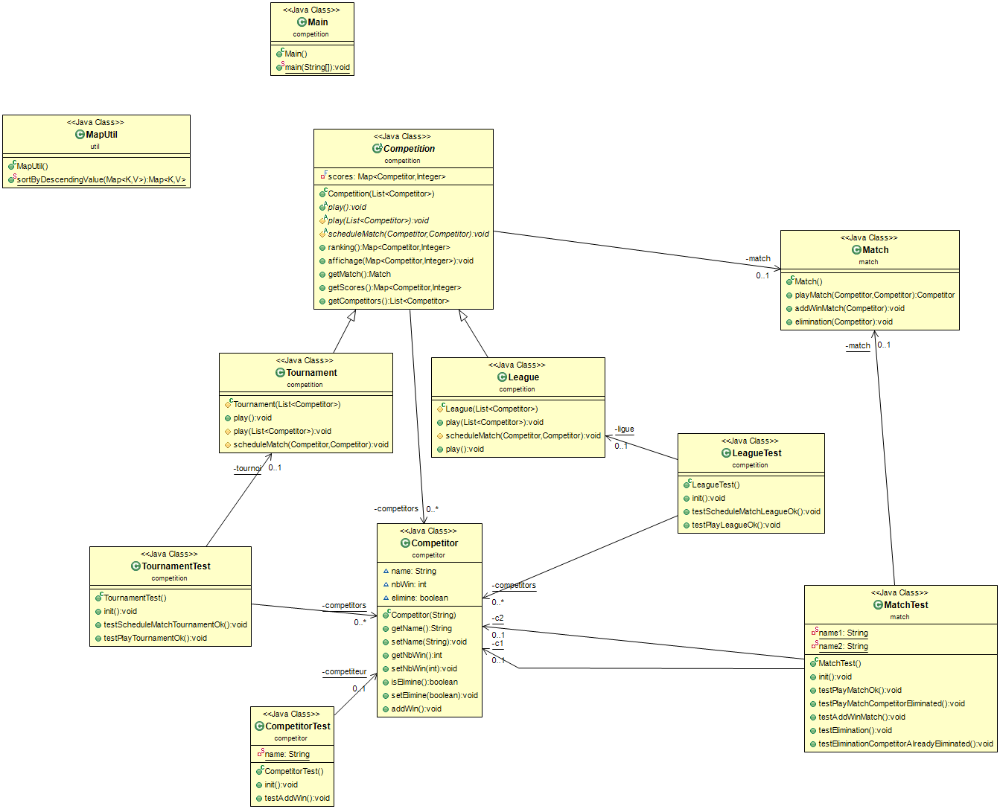

## Introduction

### HowTo
----

**Génération Automatique**
*Execute toutes les étapes de la Génération Manuelle*
```console
chmod +x script.sh
./script.sh
```
----
**Génération Manuelle**
1. recuperation du depot:

```console
git clone https://github.com/justinsillou/coo-competition
```

2. generation de la documentation `(dans /src)`

```console
javadoc -d ../docs/ -subpackages *
```

3. compilation `(toujours dans /src)`

```console
javac */*.java -d ../bin
```

4. generation de l'archive du projet `(dans /bin)`

```console
jar cvfm ../competition_v1.jar ../manifest *
```

5. execution de l'archive `(dans /projet_competitions)`

```console
java -jar competition_v1.jar
```

*Pour relancer seulement le programme executez l'archive (Étape 5)*

---

- elements de conception

	protected void play(List<Competitor> c) {
		ArrayList<Competitor> winners = new ArrayList<Competitor>();
		ArrayList<Competitor> losers = new ArrayList<Competitor>();

		for(int i = 0; i< c.size(); i++) {
			winners.add(c.get(i));
		}
		int nbComp = c.size();

		while(nbComp > 1) {
			for(int i = 0; i< winners.size(); i+=2) {
				scheduleMatch(winners.get(i),winners.get(i+1));				
			}
			for(int i = 0; i < winners.size(); i++) {
				if(winners.get(i).isElimine()) {
					losers.add(winners.get(i));
				}
			}
			for(int i = 0; i<losers.size();i++) {
				winners.remove(losers.get(i));
			}

			losers.clear();
			nbComp/=2;
		}
	}

- principes de conceptions mis en oeuvre

- valorisation du projet

**Diagrame de classe du projet**



--- 


