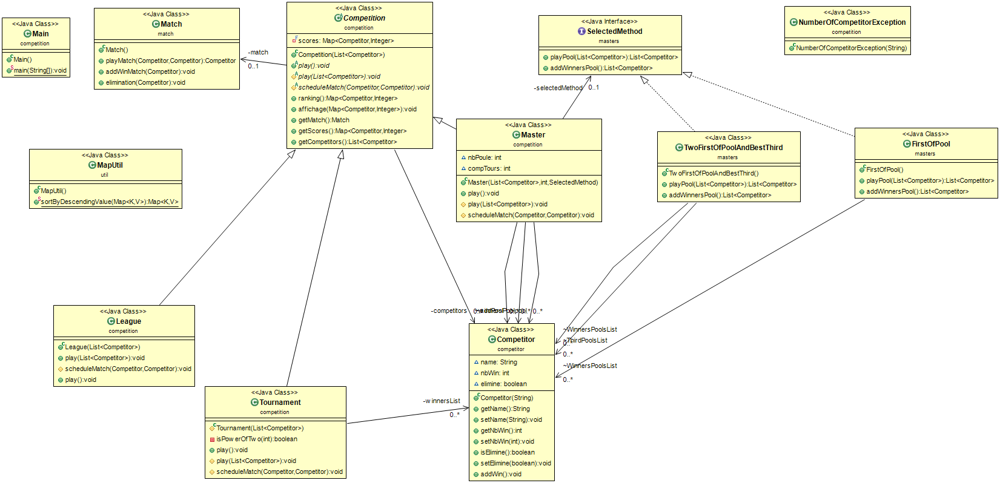

# FOFANA David & SILLOU Justin

## Introduction

__But du projet :__ Réprésentation d'une compétition sportive.
- Les championnats: matchs aller/retour, le gagnant est celui qui a le plus de victoires
- Les tournois: élimination directe sur plusieurs tours, les vainqueurs se rencontrent jusqu'à ce qu'il n'en reste qu'un.

### HowTo
----
**Génération Automatique**
*Execute toutes les étapes de la Génération Manuelle*
```console
git clone https://github.com/justinsillou/coo-competition.git
cd coo-competition/
chmod +x script.sh
./script.sh
```
----
**Génération Manuelle**
1. recuperation du depot:

```console
git clone https://github.com/justinsillou/coo-competition.git
```

2. generation de la documentation

```console
cd coo-competition/src/
javadoc -d ../docs/ -subpackages *
```

3. compilation

```console
javac */*.java -d ../bin
```

4. generation de l'archive du projet

```console
cd ../bin
jar cvfm ../competition_v1.jar ../manifest *
cd ..
```

5. execution de l'archive

```console
java -jar competition_v1.jar
```

*Pour relancer seulement le programme executez l'archive (Étape 5)*

---

- elements de conception

	```java
	SelectedMethod methode = new FirstOfPool();
	SelectedMethod methode = new TwoFirstOfPoolAndTwoBestThird();
	```
	Ajout d'une interface SelectedMethod, et de deux stratégies.

- principes de conceptions mis en oeuvre

- valorisation du projet

**Diagrame de classe du projet**



---

**Arborescence du projet**
```
.
├── bin
├── Competition_Project_Diagram.png
├── competition_v1.jar
├── docs
├── manifest
├── README.md
├── script.sh
├── src
│   ├── competition
│   │   ├── Competition.java
│   │   ├── League.java
│   │   ├── Main.java
│   │   ├── Master.java
│   │   ├── NumberOfCompetitorException.java
│   │   └── Tournament.java
│   ├── competitor
│   │   └── Competitor.java
│   ├── masters
│   │   ├── FirstOfPool.java
│   │   ├── SelectedMethod.java
│   │   └── TwoFirstOfPoolAndTwoBestThird.java
│   ├── match
│   │   └── Match.java
│   └── util
│       └── MapUtil.java
└── test
```

---


**Université de Lille 2020-2021**
